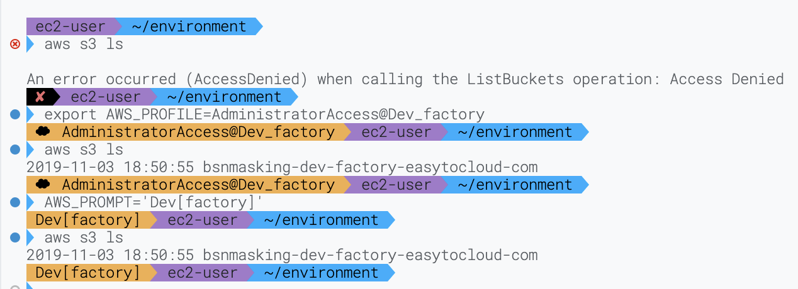

# oh-my-easytocloud

oh-my-easytocloud is an oh-my-zsh theme to spice-up your command prompt.

It is 95% identical to agnoster, just some different color scheme and support for 
AWS environments in your prompt.

AWS environments are part of [aws-profile-organizer](https://github.com/easytocloud/aws-profile-organizer)

The AWS part of the prompt is changed to display a cloud icon on an (AWS) orange background together with the value of your ``$AWS_PROFILE`` environment variable and optionally ``$AWS_ENV`` as set by aws-profile-organizer.
Should you have a ``$AWS_PROMPT`` variable set, it will be displayed instead.

## Installation

Install the theme in the ``custom/themes`` directory of your oh-my-zsh installation (usually in ``~/.oh-my-zsh/custom/themes``).

```
wget https://raw.githubusercontent.com/easytocloud/oh-my-easytocloud/main/themes/easytocloud.zsh-theme -O ~/.oh-my-zsh/custom/themes/easytocloud.zsh-theme
```

or if ``wget`` is not available on your system, use ``curl``:

```
curl https://raw.githubusercontent.com/easytocloud/oh-my-easytocloud/main/themes/easytocloud.zsh-theme -so ~/.oh-my-zsh/custom/themes/easytocloud.zsh-theme
```

Alternatively, clone this repo and then copy the theme file manually:

```
git clone https://github.com/easytocloud/oh-my-easytocloud.git
cp oh-my-easytocloud/themes/easytocloud.zsh-theme ~/.oh-my-zsh/custom/themes
```

## Activation

Change ``ZSH_THEME`` (eg. in ``~/.zshrc``) to read "easytocloud" and enjoy the new information in your prompt.

```
sed -i 's/ZSH_THEME=".*"/ZSH_THEME="easytocloud"/' ~/.zshrc
```

## Variables

The theme uses the following variables to display information in the prompt:

``AWS_PROMPT`` - if set to anything other than an empty string, the value of this variable is displayed in the prompt



In the example above, first AWS_PROFILE is not set, hence the aws command fails. 
Then AWS_PROFILE is set, the prompt displays the value of AWS_PROFILE and the aws cli command works.
Next, AWS_PROMPT is set to "Dev[factory]" and the aws cli command is run again. The prompt now displays "Dev[factory]" instead of the AWS_PROFILE value.
Notice how this has no effect on the AWS_PROFILE environment variable itself.

``AWS_ENV`` - if set to anything other than an empty string, the value of this variable is displayed in the prompt after the AWS_PROFILE value.


In the screenshot above you see the default profile is active in the training environment.
It also showcases our [privpage](https://github.com/easytocloud/privpage) aws cli integration to hide sensitive information in cli output!
