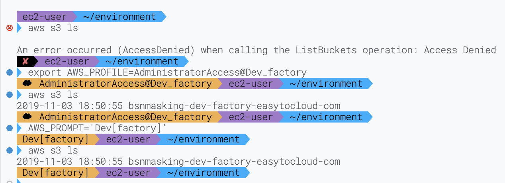

# oh-my-easytocloud

oh-my-easytocloud is an oh-my-zsh theme to spice-up your command prompt.

It is 95% identical to agnoster, just some different color scheme and support for 
AWS environments in your prompt.

## AWS Environments

AWS environments are an organizational system for managing multiple sets of AWS configuration and credential files on a single computer. They are stored in `~/.aws/aws-envs/` where each subdirectory represents a separate environment containing AWS `config` and/or `credentials` files.

This allows you to:
- Maintain different configurations for different customers
- Separate production from non-production environments
- Quickly switch between different AWS setups

You can switch environments using `ase <env-name>` which by default activates the environment globally (by updating symlinks from the standard AWS config files `~/.aws/config` and `~/.aws/credentials` to the files in the specified environment). Alternatively, use `ase --session <env-name>` to activate the environment for the current terminal session only (by setting `AWS_CONFIG_FILE` and `AWS_SHARED_CREDENTIALS_FILE`).

The AWS part of the prompt displays a cloud icon on an (AWS) orange background together with the value of your `$AWS_PROFILE` environment variable and optionally `$AWS_ENV`.
Should you have a `$AWS_PROMPT` variable set, it will be displayed instead.

### Direct Credentials Display

When using direct AWS credentials (e.g., from SSO login or IAM user keys), the prompt intelligently displays credential information:

- **ASIA keys** (temporary SSO/STS credentials): Shows `☁ ASIA|<role>@<account>`
  - Extracts the role name from SSO assumed roles (e.g., `_cloudX` from `AWSReservedSSO__cloudX_...`)
  - Matches the account ID against profiles in your AWS config to display a friendly account name

- **AKIA keys** (IAM user long-term credentials): Shows `☁ AKIA|<username>@<account>`
  - Extracts the IAM username from the ARN
  - Matches the account ID to display the account name

The account name is derived from your AWS config file by matching the `sso_account_id` against profiles in the format `<role>@<account>`. If no matching profile is found, the last 4 digits of the account ID are displayed (e.g., `**3720`).

## Installation

Install with a single command:

```bash
sh -c "$(curl -fsSL https://raw.githubusercontent.com/easytocloud/oh-my-easytocloud/main/install.sh)"
```

The installer will:
- Download the theme and plugin files
- Automatically configure your `~/.zshrc` with the easytocloud theme
- Add the easytocloud plugin to your plugins list
- Create a backup of your `.zshrc` as `.zshrc.bak`

After installation, restart your terminal or run `source ~/.zshrc`.

## AWS Commands

The easytocloud plugin extends the standard AWS plugin with additional commands for managing AWS environments:

### Environment Commands
- `ase [--global|--session] <env-name>` - AWS Set Environment (with tab completion)
  - `--global` (default): Activates the environment globally via symlinks — affects all terminals
  - `--session`: Activates the environment for this terminal session only via environment variables
  - `--add <env-name>`: Creates a new empty environment with blank `config` and `credentials` files
  - When called without a valid environment name, lists available environments with indicators:
    - `*` (green) — active in both this session and globally
    - `>` (yellow) — active in this session only
    - `~` (blue) — active globally, but this session uses a different environment
    - A legend is shown automatically when the session and global environments differ
  - The legacy positional options `link` (use `--global`) and `env` (use `--session`) are deprecated
- `age` - AWS Get Environment (shows current environment)
- `acc` - AWS Clear Credentials (removes all AWS credential variables)

### Standard AWS Plugin Commands
The plugin also includes all commands from the standard oh-my-zsh AWS plugin:
- `asp <profile>` - AWS Set Profile
- `agp` - AWS Get Profile
- `asr <region>` - AWS Set Region (with tab completion)
- `agr` - AWS Get Region
- `aws_profiles` - List available profiles

## Variables

The theme uses the following variables to display information in the prompt:

``AWS_PROMPT`` - if set to anything other than an empty string, the value of this variable is displayed in the prompt



In the example above, first AWS_PROFILE is not set, hence the aws command fails. 
Then AWS_PROFILE is set, the prompt displays the value of AWS_PROFILE and the aws cli command works.
Next, AWS_PROMPT is set to "Dev[factory]" and the aws cli command is run again. The prompt now displays "Dev[factory]" instead of the AWS_PROFILE value.
Notice how this has no effect on the AWS_PROFILE environment variable itself.

``AWS_ENV`` - if set to anything other than an empty string, the value of this variable is displayed in the prompt after the AWS_PROFILE value.


In the screenshot above you see the default profile is active in the training environment.
It also showcases our [privpage](https://github.com/easytocloud/privpage) aws cli integration to hide sensitive information in cli output!
